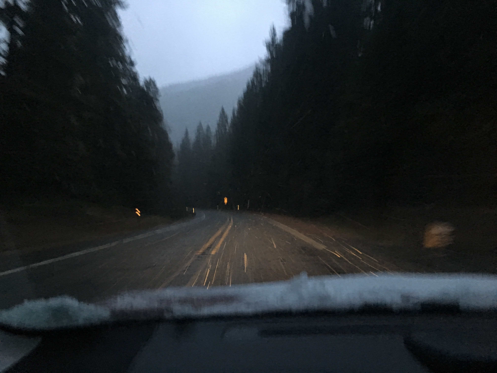

### "There are more things in heaven and earth, Horatio, than are dreamt of in your philosophy"

One of the first podcasts I really fell in love with is a science fiction podcast named "Tanis." The series is set in the Pacific Northwest and my 6am, rainy drives to work at Joint Base Lewis McChord in Tacoma, WA made the perfect backdrop for listening.

In the intro of the first episode the narrator sets up the mystery of Tanis as the "the last great mystery," and explains this to be valuable because all other uncertainty was left us as we entered the age of the Internet.

This into made sense to me in 2015, and I assume to others as well. But none of the philosophical problems of knowledge that philosophers have talked about for centuries have been satisfactorily resolved and there are still large gaps in our scientific and factual understanding of the world. The speed at which we are able to access information has no bearing on that.

I believe this shared illusion was shattered in 2016 with the election of Donald Trump. Ever since this vote the collective American culture has been obsessed with misinformation, spies and intrigue, and the unreliability of the internet for accessing truth. Though, there is still a sense that we can wrestle back our pre-2016 certainty if we just had the right checks from the appropriate authorities (some, bizarrely, believe the correct authorities to be Twitter, Facebook, and Google.) An interesting example I stumbled on is a paper arguing for "epistemic rights" found <a href="https://www.tandfonline.com/doi/figure/10.1080/02691728.2018.1440022?scroll=top&needAccess=true">here.</a> Unfortunately, I am unable to access the paper without paying (ironic since there arguement is based partly on the "right ro know"). The thesis, which I gathered from other sources, is that individuals have a right to not be mislead and a right to "true" information. This turns the idea of natural rights on its head since it argues for a right to decide what others are to believe, instead of a for a right to believe what you will. Thankfully, no such right can be forced on us, since we are each epistimologically an island in a sense. We can take and share, but at the end of the day no one is even able to know what you truly believe.

I do not share this belief that we can ge tto a point of certainty in our culture, and I think instead our culture must accept that our certainty was misplaced and move forward into a world where there isn't universal agreement on matters of fact. I hope to write more articles on skepticism, since I now believe as Paul Feyerabend wrote in "Against Method", that

> ...anarchism, while perhaps not the most attractive political philosophy, is certainly excellent medicine for epistemology, and for the philosophy of science.
