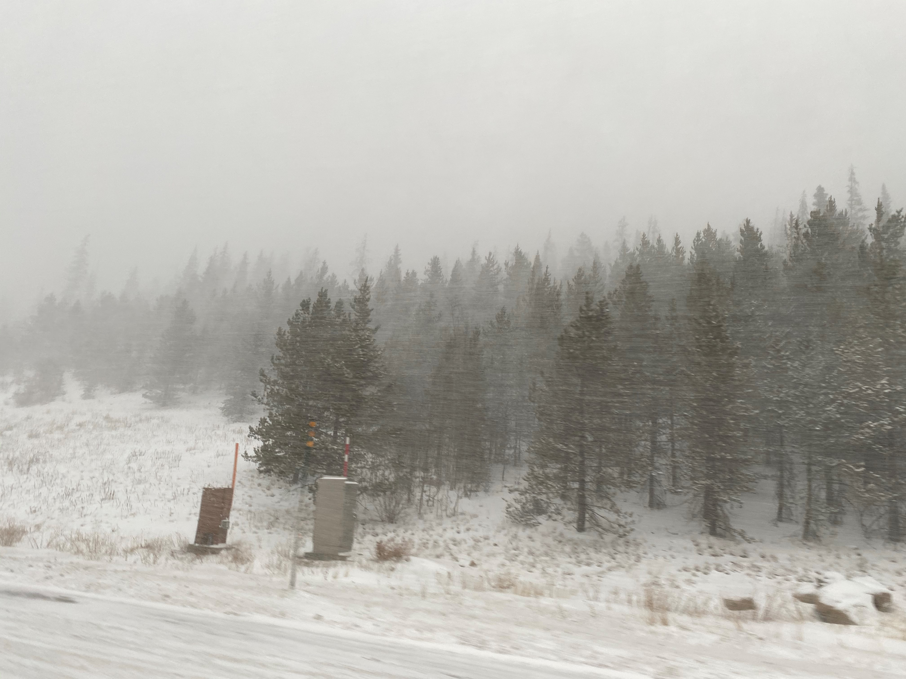
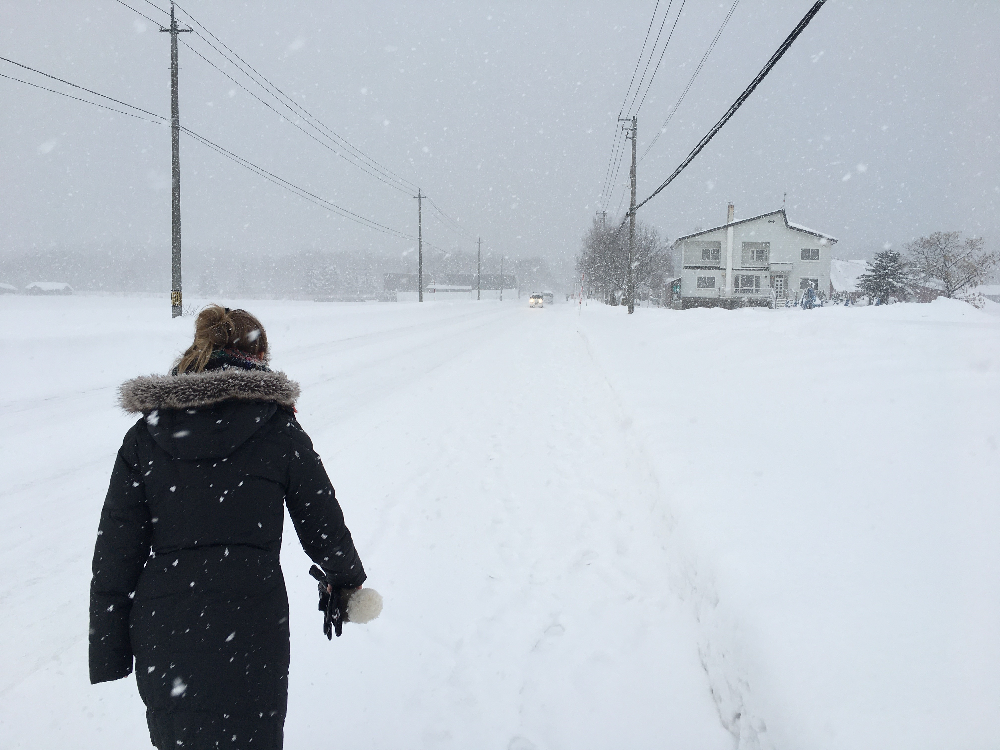

### Why it is nearly impossible to complete school work at the moment

It has become progressively harder to accomplish any sort of school work as we draw nearer to winter and another ski season is afoot. This is of course an awful time to lose motivation as quite a bit of theory has been developed now in the classes I am taking, and so the tests and problem sets having gotten proportionately more difficult.

Sierra and I were lucky to ski at Arapahoe Basin last Saturday (21 Nov 2020), which was a lot of fun in spite of the fact that only one run was open. The prior Saturday we were headed up to A Basin and were stoked about the seemingly improving ski conditions, but loveland pass was closed due to an unforseen amount of snow piling up. 

We would have skied at Loveland but due to covid you couldn't buy passes in person and needed a reservation. Sierra was hesitant to drive the extra hour to up to the other side of the mountain to A Basin, since our dog was waiting for us at home, so we bailed.

But, since getting the first day in last Saturday, I have been incappable of thinking of things other than skiing. Today, while taking our dog to the local dogpark I was able to get a glimpse of the Indian Peaks and Longs Peak finally getting covered in snow.

Me and Sierra will be spending a week in Jackson, WY this Decemeber, and I couldn't be more excited. It will probably be a little early yet for huge winter storms, but I find myself dreaming that the conditions will be like the week we spent in Niseko, Japan in January.

