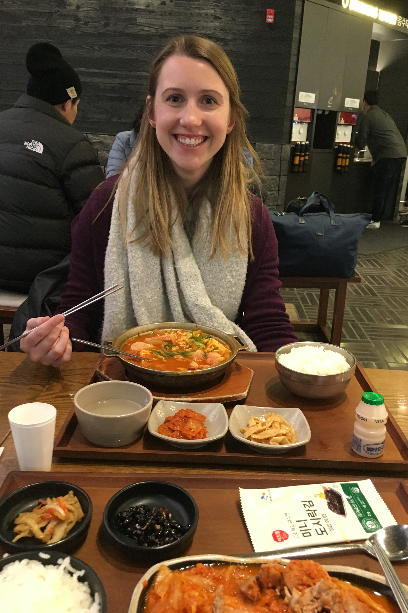
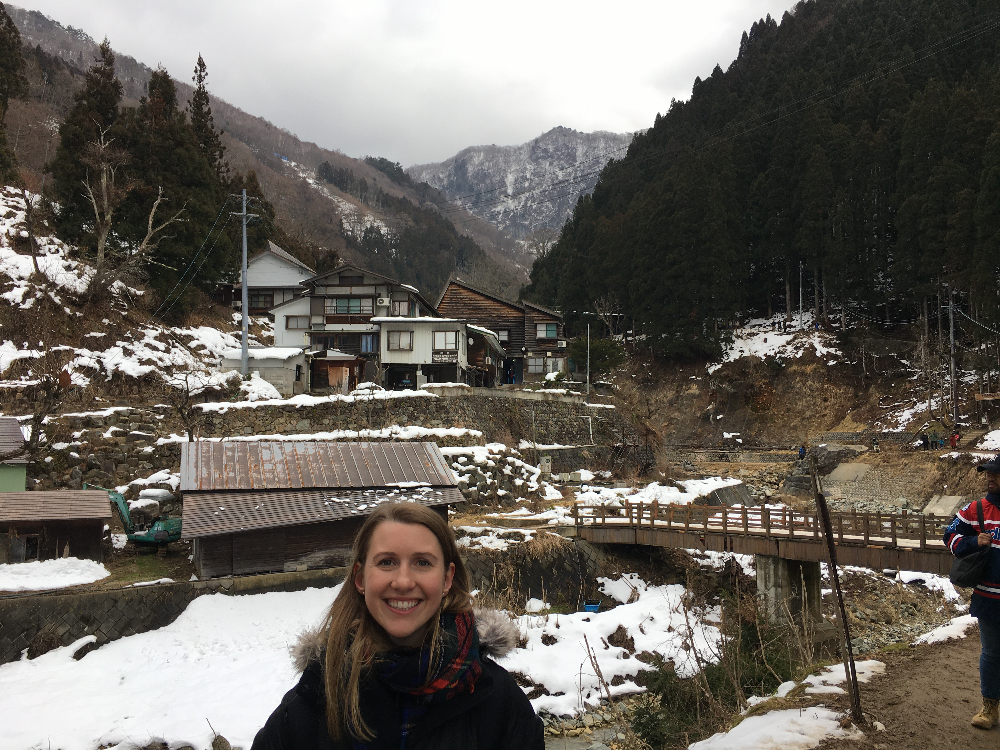

### A small recap and some pictures from the year

Sierra (my Wife) tested positive for covid on 23 Dec. It was the day we were supposed to be preparing for a week long trip to Jackson Hole. We have instead been quarantining in our apartment since.

Instead of complaining too much, I'm gonna share some of the big moments from 2020 for me.

My year started in Korea. Sierra was visiting. She had arrived just before Christmas. After a 14 hour flight, she was a champ and we went out and found the only restaurant we could find that was open in the Ville outside Camp Humphreys and ended up drinking until about 2am.

The best was to come though, as we were planning to spend two weeks in Japan in January. This was a meal we had at the airport before leaving for Japan.

We flew into New Chitose airport in Hokkaido and then made our way to Niseko for a week of skiing. 

Next, we went to Tokyo and explored that area some, including going to the Nagano Monkey Park.

