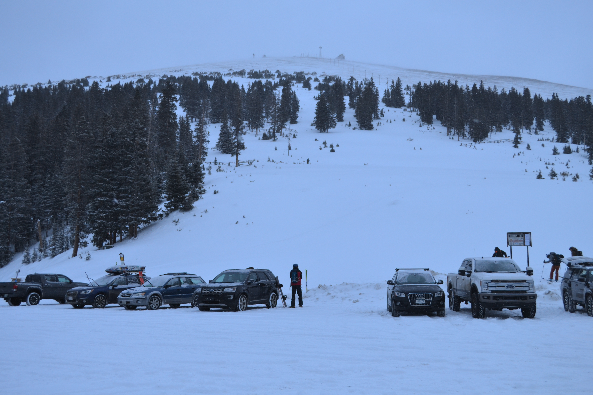
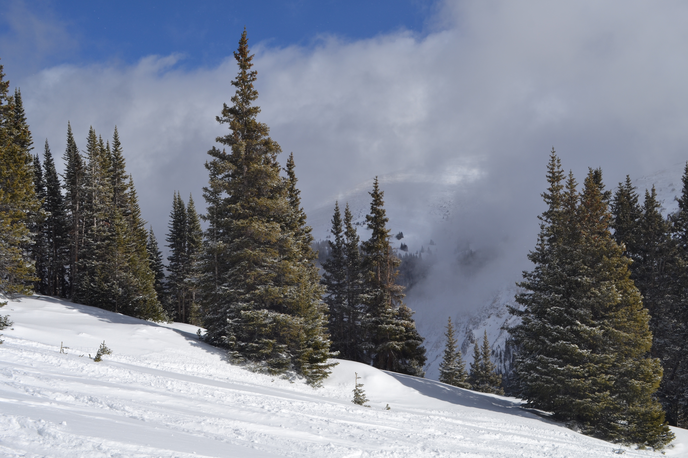

### Finally starting to ski outside the resort

In December (2020), I took an AIARE 1 avalanache course. Unfortunately, this was right before my Wife tested positive for Covid and we had to quarentine. 

After we were all clear though, we were finally able to get out into the backcountry a bit on our own. Our first stop was the obvious: Berthoud Pass.

We went Saturday, Jan 16th 2021 and Monday, Jan 18th 2021 (had the day off for MLK day) and had a great time. Here are some pictures and a video.

<iframe width="100%" height="500"  src="https://www.youtube.com/embed/M4RWLoL2BTc" frameborder="0" allow="accelerometer; autoplay; clipboard-write; encrypted-media; gyroscope; picture-in-picture" allowfullscreen></iframe>