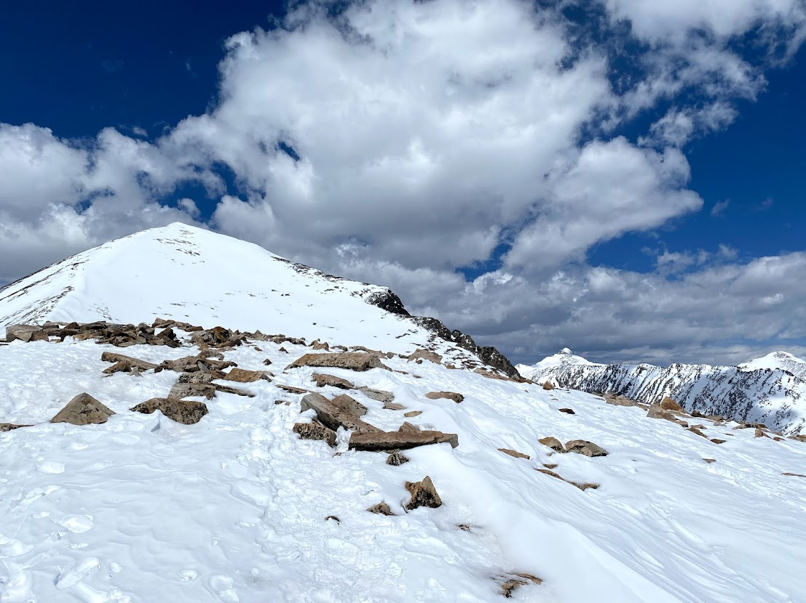
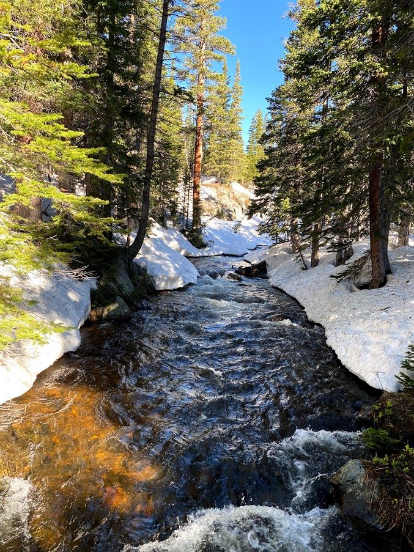

Since the semester ended I have had a few good oppurtinities to get outside and ski. On May 14th I was abke ski Quandary Peak with Jake in the Tenmile Range. Qundary is 14,271 feet, and very popular with hikers later in the summer. Late spring is an opportune time to ski Quandary as the heavy "Upslope" storms have blanketed the eastern mountains of Colorado, and warm temps have stabilized avalanche conditions to a degree. We skied the East Ridge which is the primary hiking route. It is an easy ski line, and made for a good 2500 feet of skiing along with a bit of hiking in our ski boots near the trailhead.

<iframe height="400" frameBorder="0" style="width: 80%; margin:0 10%;" src="https://fatmap.com/routeid/2783212/east-ridge-of-quandary?fmid=em"></iframe>

More recently, Levi and I attempted to ski the Northeast Face of Jasper Peak on June 4th, but we were on a tight timeline since Levi had to be back in Boulder for a zoom call by noon. We arrived at the trailhead around 6:30 and started with our boots and skis on our packs since there was no snow at the trailhead. We climbed mixed trail and postholing most of the way before we were able to put on skis and travel up through some thick forest aiming for Jasper Peak. We realizes we would have no chance of skiing the face in time, so settle on getting a few hundred feet of skiing back to the trail. Who could complain about getting turns in June?

The next day, Sierra and I started a backpacking trip to Jasper Peak in the Indian Peak Wilderness. It was only a five mile hike to our campsite, but it constisted of a lot of post-holing through intermittent snow that made the hike quite difficult. We got to the campsite and there was light rain that cleared up relatively quickly. We started late in the day, around 2pm, so by the time we got to our campsite it was dinner time. We made dinner, and then not to shortly after got in our sleeping bags to get some sleep. The next morning we woke up to clear skies, but that slowly changed with some cloud cover rolling in. The hike out was much easier than the hike in, though there was still lots of post-holing.

On 11 June, Levi and I skied Mount Toll (12,979'). We wanted to time conditions correctly, and our planning had us leaving the trailhead at 4:30 am. Unfortunately the gate was not yet open, so we waited until 5 for the gate to open, parked about a mile further up, and started hiking about 10 minutes later. We hiked (post-holed) in ski boots the whole way (minus about 100 feet of ill-advised skinnning.) The snow was very firm which is great as it meant lower avalanche risk, but we were quickly wondering whether we made the right choice to not bring an ice-axe or crampons. Luckily, the June sun worked its magic by the time it mattered and conditions turn out to be quite nice for booting up the Southeast Face of Mount Toll. We skied about 1453 feet of great soft snow. You can see our approximate ski line here:

<iframe height="400" frameBorder="0" style="width: 80%; margin:0 10%;" src="https://fatmap.com/routeid/2781834/southeast-face-mount-toll?fmid=em"></iframe>

