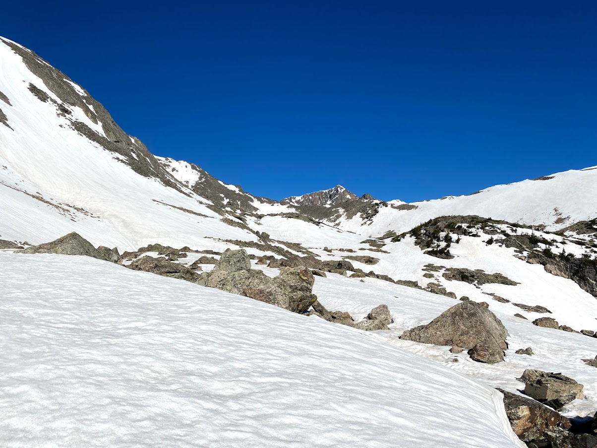

Since the semester ended I have had a few good oppurtinities to get outside and ski. On May 14th I was abke ski Quandary Peak with Jake in the Tenmile Range. Qundary is 14,271 feet, and very popular with hikers later in the summer. Late spring is an opportune time to ski Quandary as the heavy "Upslope" storms have blanketed the eastern mountains of Colorado, and warm temps have stabilized avalanche conditions to a degree. We skied the East Ridge which is the primary hiking route. It is an easy ski line, and made for a good 2500 feet of skiing along with a bit of hiking in our ski boots near the trailhead.

More recently, Levi and I attempted to ski the Northeast Face of Jasper Peak on June 4th, but we were on a tight timeline since Levi had to be back in Boulder for a zoom call by noon. We arrived at the trailhead around 6:30 and started with our boots and skis on our packs since there was no snow at the trailhead. We climbed mixed trail and postholing most of the way before we were able to put on skis and travel up through some thick forest aiming for Jasper Peak. We realizes we would have no chance of skiing the face in time, so settle on getting a few hundred feet of skiing back to the trail. Who could complain about getting turns in June?

The next day, Sierra and I started a backpacking trip to Jasper Peak in the Indian Peak Wilderness. It was only a five mile hike to our campsite, but it constisted of a lot of posting holing through intermitent snow that might the hike quite difficult. We got to the campsite and there was light rain that cleared up relatively quickly. The next morning

