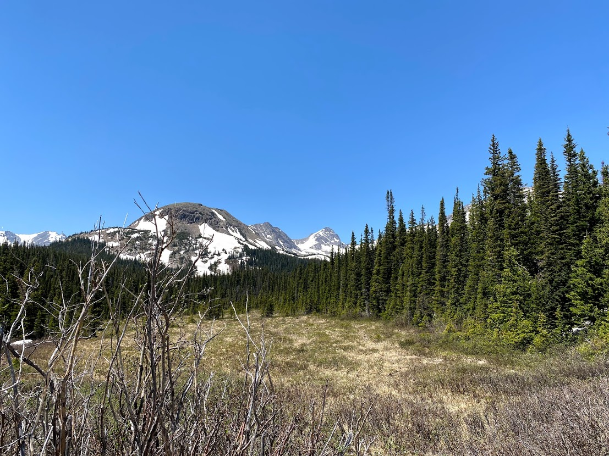

As I've used this blog more, I've realized that it is actually a great medium for posting about trips and adventures. So, I will start grouping activities together by timeframe in some manner that I think makes sense. This will be the first one and captures trips from May and June, which has primarily consisted of skiing and backpacking.

## Skiing Quandary Peak, May 14

Since the semester ended I have had a few good oppurtinities to get outside and ski. On May 14th I was able ski Quandary Peak with Jake in the Tenmile Range. Quandary is 14,271 feet, and very popular with hikers later in the summer. Late spring is an opportune time to ski Quandary as the heavy "Upslope" storms have blanketed the eastern mountains of Colorado, and warm temps have stabilized avalanche conditions to a degree. We skied the East Ridge which is the primary hiking route. It is an easy ski line, and made for a good 2500 feet of skiing along with a bit of hiking in our ski boots near the trailhead. This is just the second 14er I have made it to the top of, the other being a simple hike up Mount Bierstadt, and my first time skiing a 14er. Below you will see a 'fatmap' look at our route which I traced using my gps watch.

<iframe height="400" frameBorder="0" style="width: 100%" src="https://fatmap.com/routeid/2783212/east-ridge-of-quandary?fmid=em"></iframe>

 
 

## Jasper Attempt, June 4

More recently, Levi and I attempted to ski the Northeast Face of Jasper Peak on June 4th, but we were on a tight timeline since Levi had to be back in Boulder for a zoom call by noon. We arrived at the trailhead around 6:30 and started with our boots and skis on our packs since there was no snow at the trailhead. We climbed mixed trail and postholing most of the way before we were able to put on skis and travel up through some thick forest aiming for Jasper Peak. We realizes we would have no chance of skiing the face in time, so settle on getting a few hundred feet of skiing back to the trail. Who could complain about getting turns in June?

## Backpacking trip to Jasper Lake, June 5-6

The next day, Sierra and I started a backpacking trip to Jasper Peak in the Indian Peak Wilderness. It was only a five mile hike to our campsite, but it constisted of a lot of post-holing through intermittent snow that made the hike quite difficult. We got to the campsite and there was light rain that cleared up relatively quickly. We started late in the day, around 2pm, so by the time we got to our campsite it was dinner time. We made dinner, and then not to shortly after got in our sleeping bags to get some sleep. The next morning we woke up to clear skies, but that slowly changed with some cloud cover rolling in. The hike out was much easier than the hike in, though there was still lots of post-holing.

## Skiing Mount Toll, June 11

On 11 June, Levi and I skied Mount Toll (12,979'). We wanted to time conditions correctly, and our planning had us leaving the trailhead at 4:30 am. Unfortunately the gate was not yet open, so we waited until 5 for the gate to open, parked about a mile further up, and started hiking about 10 minutes later. We hiked (post-holed) in ski boots the whole way (minus about 100 feet of ill-advised skinnning.) The snow was very firm which is great as it meant lower avalanche risk, but we were quickly wondering whether we made the right choice to not bring an ice-axe or crampons. Luckily, the June sun worked its magic by the time it mattered and conditions turn out to be quite nice for booting up the Southeast Face of Mount Toll. We skied about 1453 feet of great soft snow. Unfortunately I forgot to start my gps watch for the trip, but below I outlined an approximate route that you can see in fatmap.

<iframe height="400" frameBorder="0" style="width: 100%;" src="https://fatmap.com/routeid/2781834/southeast-face-mount-toll?fmid=em"></iframe>

 
 

For me, skiing Mount Toll was my biggest skiing accomplishment to date. The peak is easily visible from multiple places around Louisville, and I am rewarded with a small burst of pride every time I see it.

## Trail Ridge Road, June 18

Levi and I skied some small lines (~300 feet) off of Trail Ridge Road in RMNP. Incredibly warm weather in the Front Range had caused conditions to rapidly deteriorate and so there really isn't much good skiing left anywhere. I have gotten kind of attached to the idea of doing 'Turns All Year' now, which is seeing how many months in a row you can ski, and so I will probably have to get creative/desperate to find any snow to ski in August and September.

## Small Chutes Near Niwot Ridge, June 23

Levi and I skied some small chutes (~400 feet) on a flank of Niwot Ridge above Long Lake. The air was smoky due to some fires that have already started a bit west of here.

## Buffalo Mountain Hike, June 25

Unfortunaly hurt my bike lifting, so I am sticking to hiking for a bit. I hiked Buffalo Mountain near Frisco. Its a mountain that I really like because it has a great ski line on it called the Silver Couloir that I hope to ski at some point.

