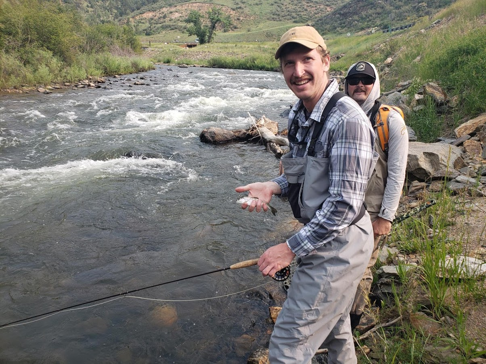
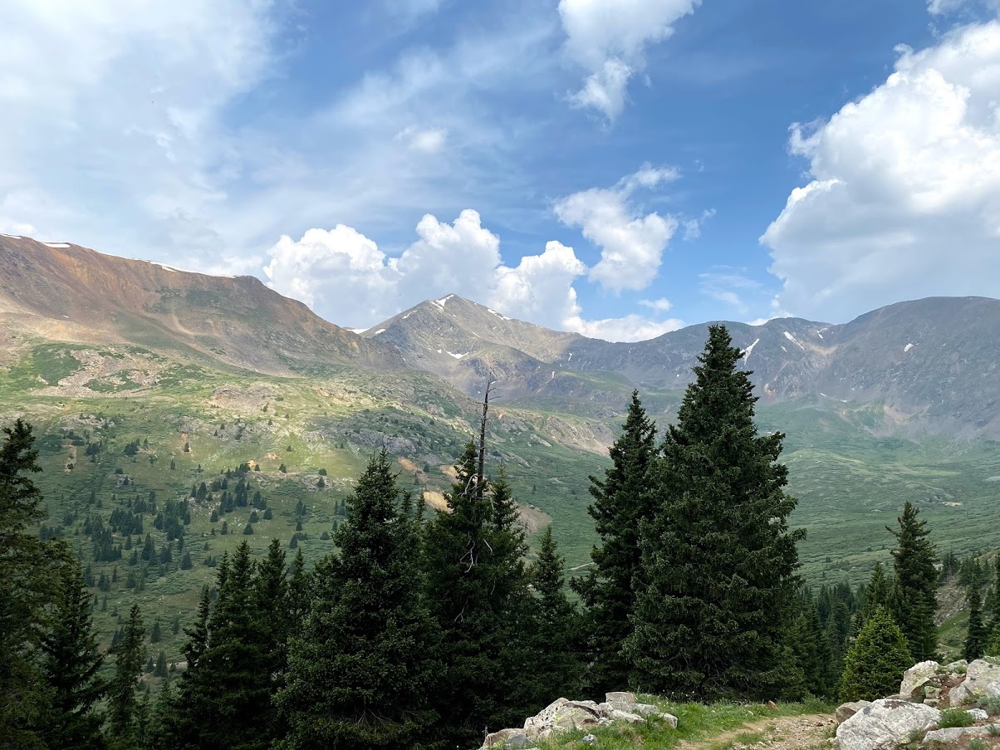
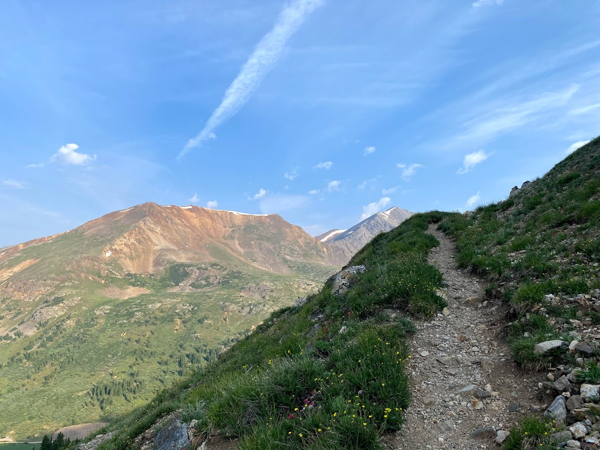
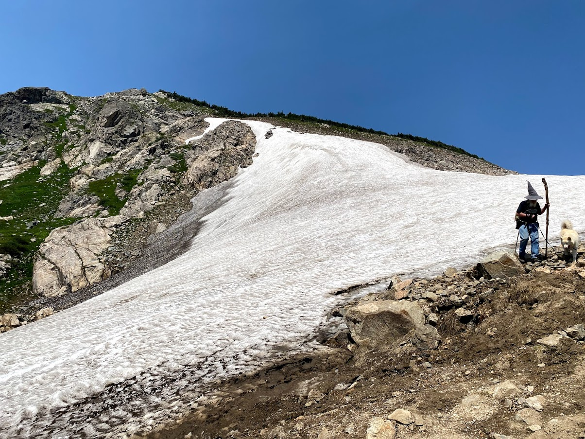
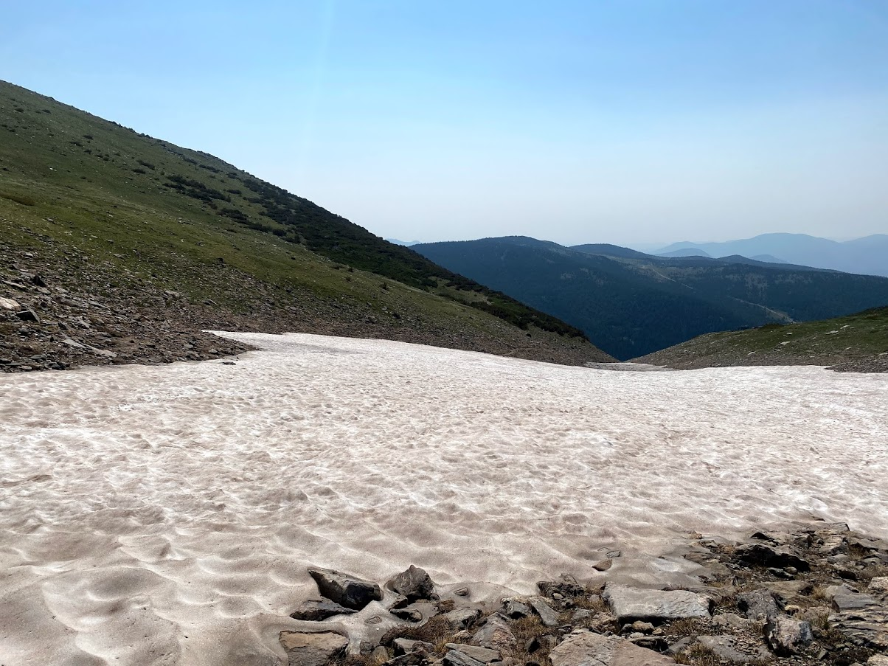
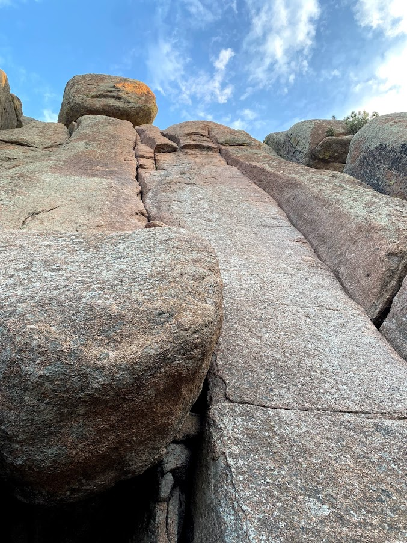
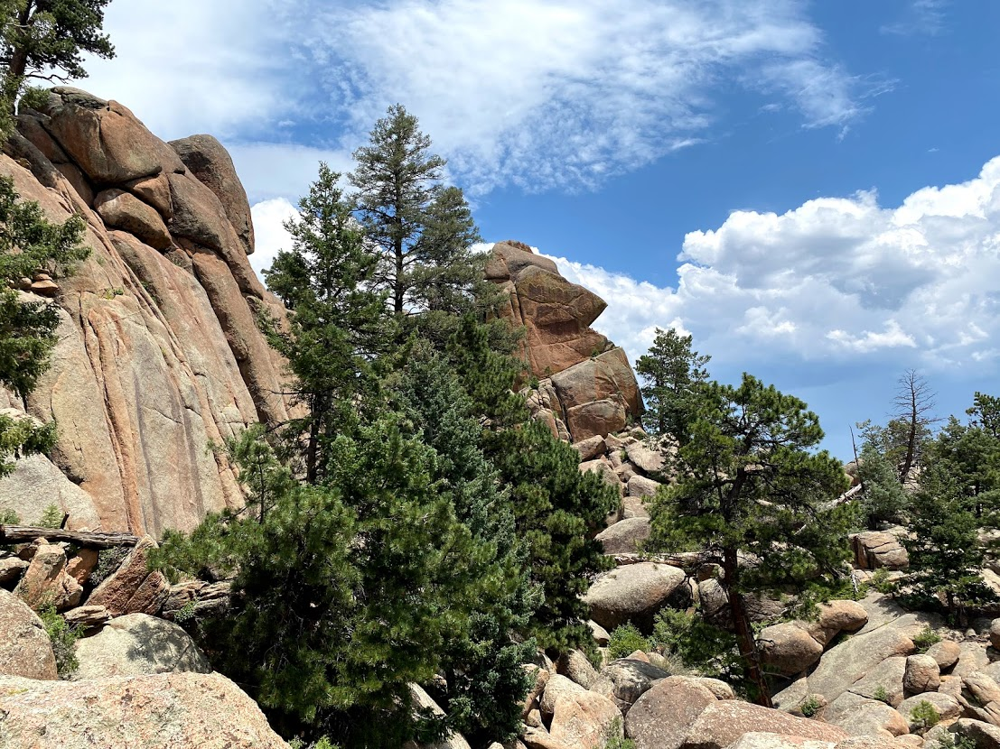

## Pettingell Peak Hike, July 3

Sierra and I, in the process of moving apartments, got to get out and hike Pettingell Peak. The weather couldn't have been better with clear skies all morning. We hiked the South Slopes which required a bit of route finding, but nothing serious. This area has a ton of good ski lines, and Sierra and I plan to ski off the summit of Pettingell Peak next spring. It isn't too serious of a route, but requires good conditions, since the hike up travels through multiple avalanche slide paths. The first picture below is of the route we climbed, the second picture is of a nearby peak called The Citadel.

## Square Top Mountain, July 11

Sierra and I went hiking with our friends Erin and Andrew. It was a great peak, without too many other hikers. It was also another great chance to scout out ski lines for next season. The East Bowl of Square Top looks like it would be a great, challenging ski descent. Though, it would be quite a long distance depending on whether the road was clear to the trailhead or not. It was also cool to get a different perspective on Grays and Torreys, Argentine Peak and Mount Edwards.

## Clear Creek Fishing, July 12

My brother Nick hired a guide to show him some good spots to fish along Clear Creek just outside of Golden, and he invited me along for the day. I do not know the first thing about fishing, but it was a good day out regardless. Having the guide made things very easy to the point that I caught 6 fish.

## Mount Edwards, July 13

I hiked Mount Edwards (13,850') from Argentine Pass Trailhead. It was mostly just an easy, unneventful hike and my main motivation for picking this hike was to see Horseshie Basin. Unfortunately it was quite hazy out from some fires out west.

## Saint Mary's Glacier, July 15

In order to get July turns in, I did an easy day out on Saint Mary's Glacier. THe trail was jam packed with people, including one wizard, but the turns were fairly good for July. I made two runs down the glacier, each about 500' in elevation.

## Turkey Rocks and Elevnmile Canyon Climbing, July 18-19

Sierra and I went climbing in the South Platte this weekend at Turkey Rocks and Elevenmile Canyon. I lead a few easy 5.7s at Turkey rocks and we top-roped a few harder climbs.

