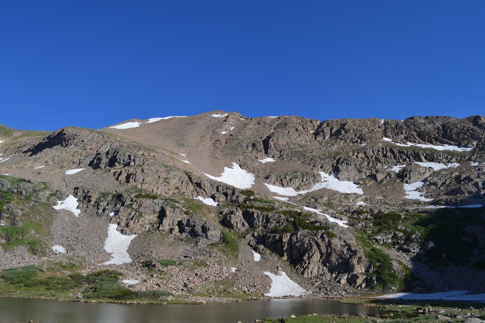
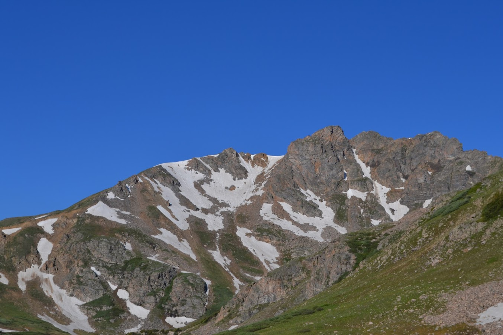
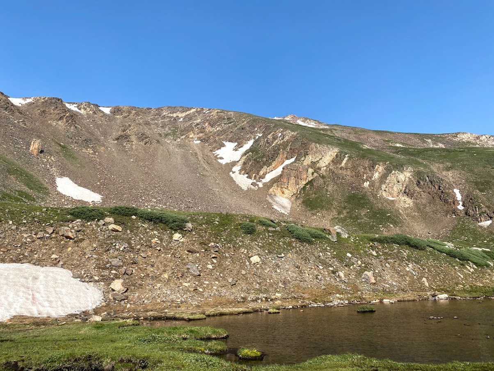
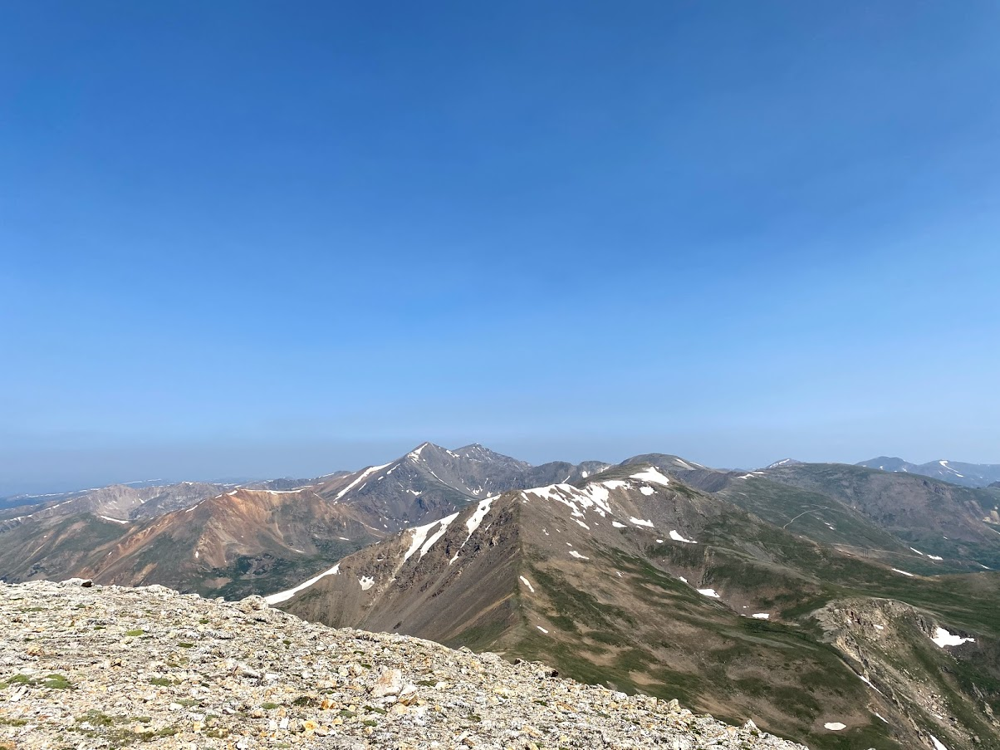

## Pettingell Peak Hike, July 3

Sierra and I, in the process of moving apartments, got to get out and hike Pettingell Peak. The weather couldn't have been better with clear skies all morning. We hiked the South Slopes which required a bit of route finding, but nothing serious. This area has a ton of good ski lines, and Sierra and I plan to ski off the summit of Pettingell Peak next spring. It isn't too serious of a route, but requires good conditions, since the hike up travels through multiple avalanche slide paths. The first picture below is of the route we climbed, the second picture is of a nearby peak called The Citadel.

## Square Top Mountain, July 11

Sierra and I went hiking with our friends Erin and Andrew. It was a great peak, without too many other hikers. It was also another great chance to scout out ski lines for next season. The East Bowl of Square Top looks like it would be a great, challenging ski descent. Though, it would be quite a long distance depending on whether the road was clear to the trailhead or not. It was also cool to get a different perspective on Grays and Torreys, Argentine Peak and Mount Edwards.

