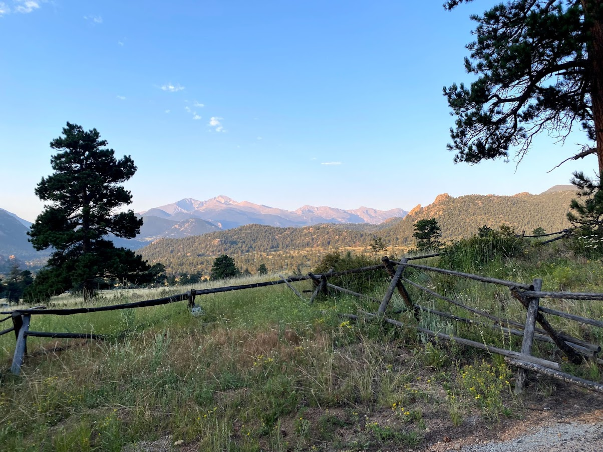
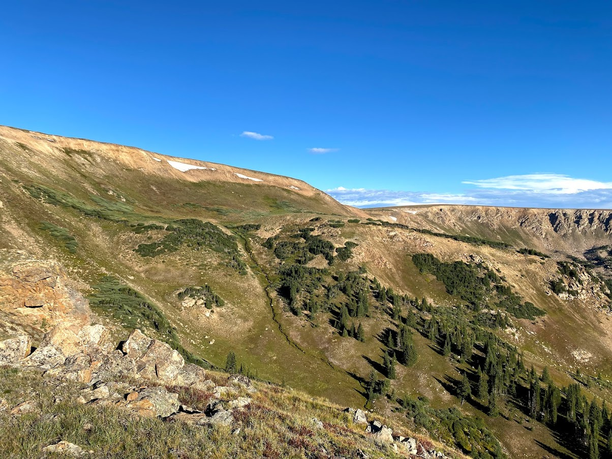
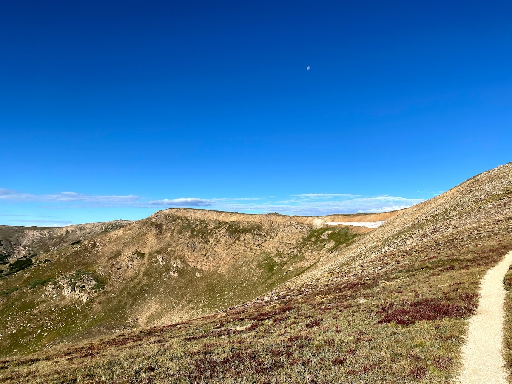
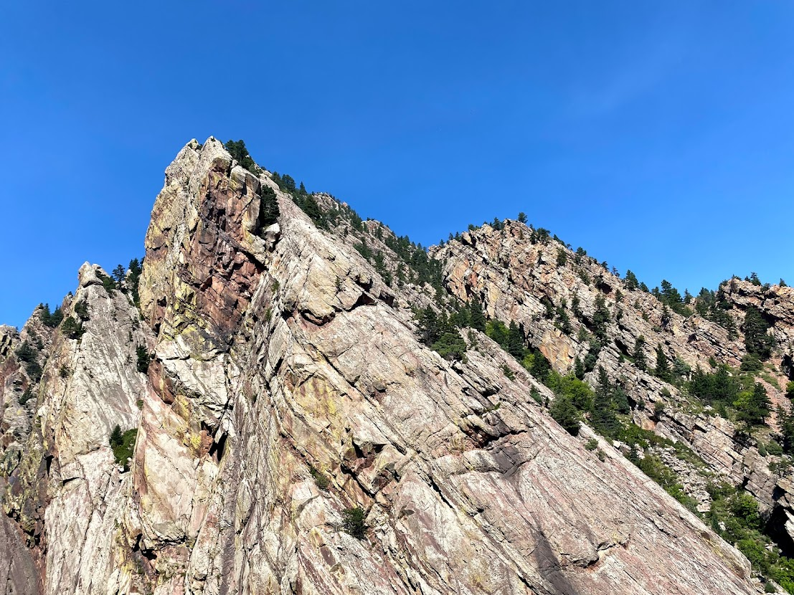

I've been a bit busier this month with the start of the new semester but I have gotten out a bit. Colorado has been dealing with a ton of smoke from fires farther out west this summer, so I have been a little less excited to get out than usual. There have been some good days however, and things are starting to get even better as we transistion to fall. Here are some random photos from this month:

## Bastille Crack, 28 Aug

Sierra and I climbed the Bastille Crack in Eldorado Canyon on Saturday. It is one of the most well known climbs in the country and has a reputation for beginning trad climbers making mistakes, going slow, and sometimes getting hurt. It's a 5 pitch, 5.7 route up the Bastille. It is quite steep for a 5.7 route, with some of the pitches being near vertical. I had climbed it 3 times before, but this was my first time leading all of the pitches. Below is a view of Redgarden Wall from the top of the Bastille and then a picture of Sierra and I at the top of the Bastille.+

