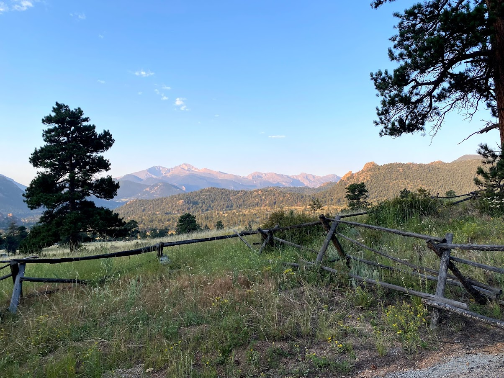
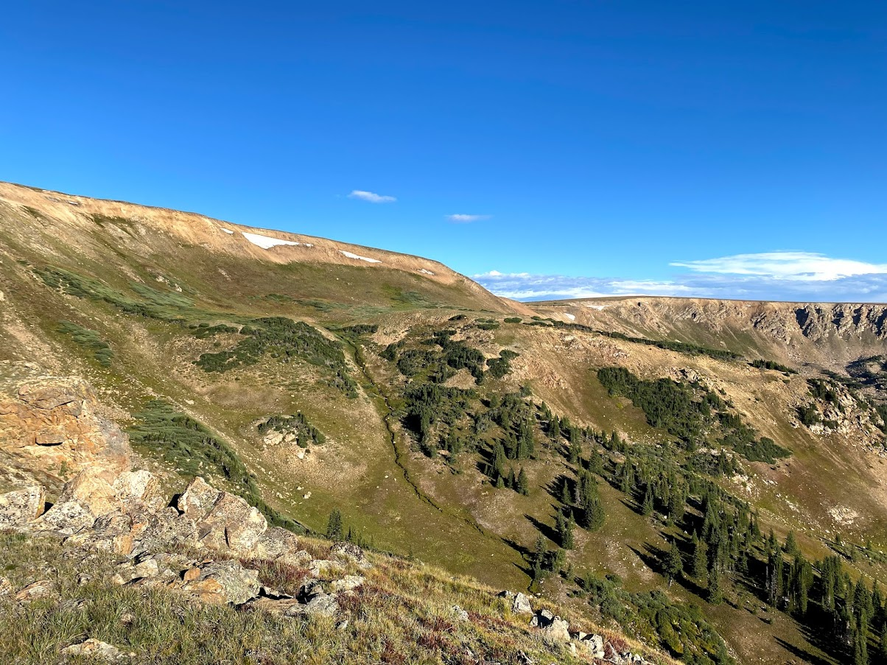
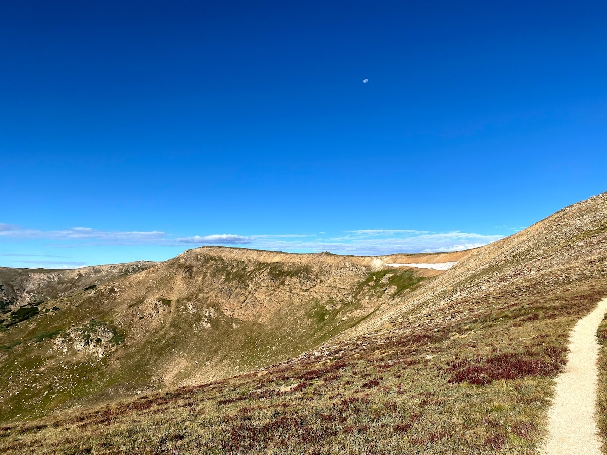

I've been a bit busier this month with the start of the new semester but I have gotten out a bit. Colorado has been dealing with a ton of smoke from fires farther out west this summer, so I have been a little less excited to get out than usual. There have been some good days however, and things are starting to get even better as we transistion to fall. Here are some random photos from this month:

