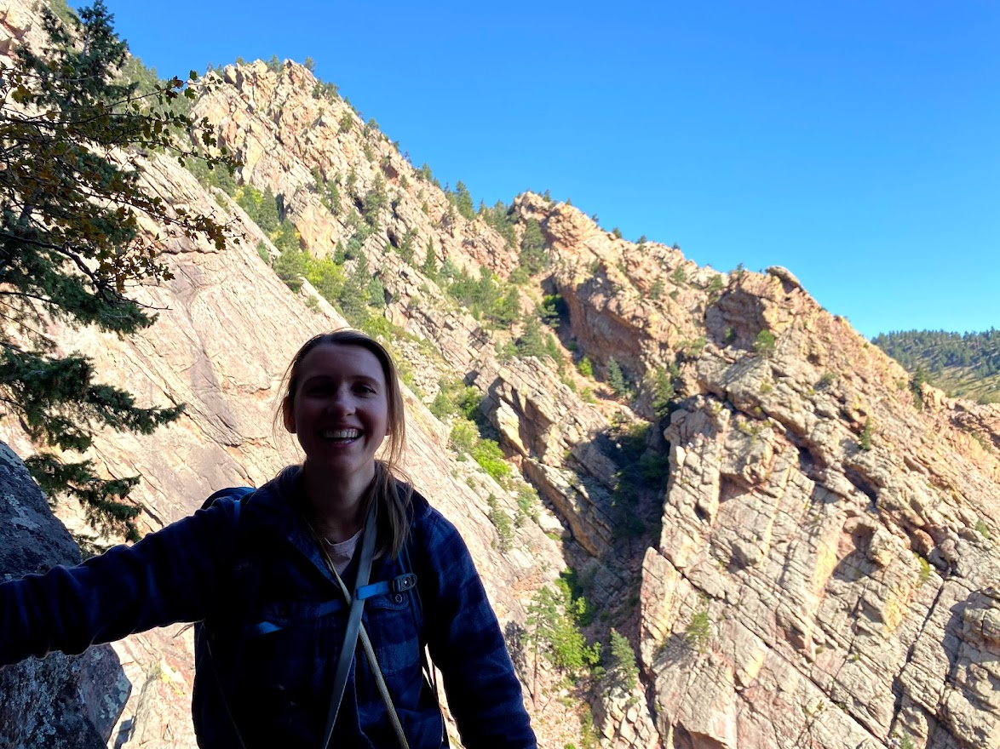
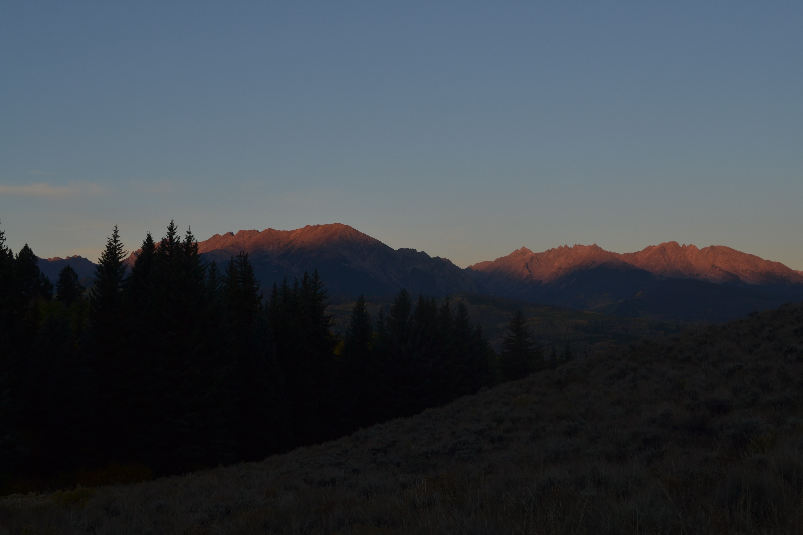
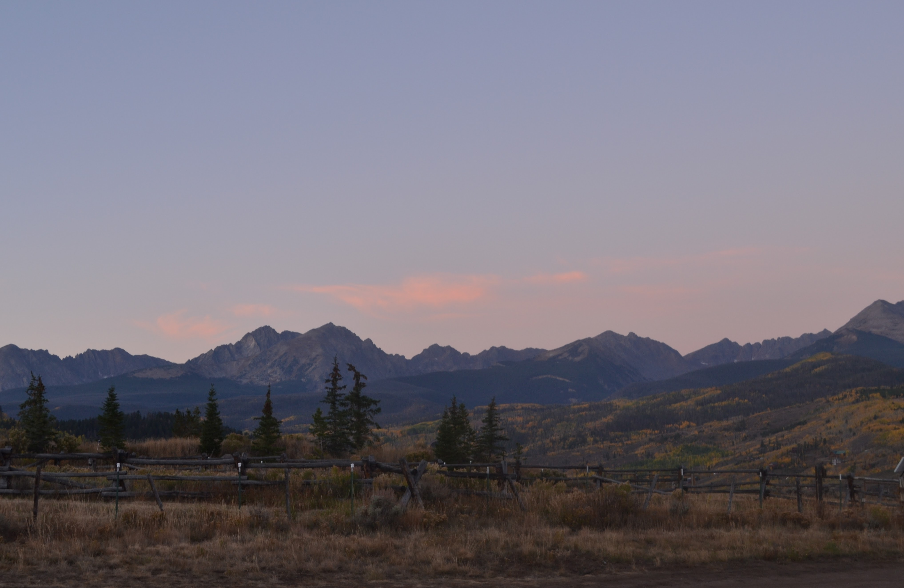
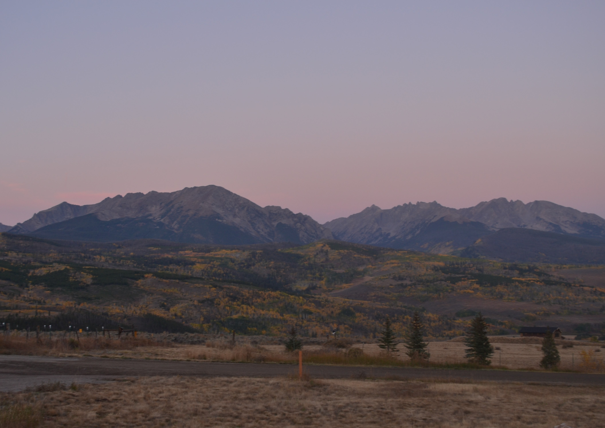
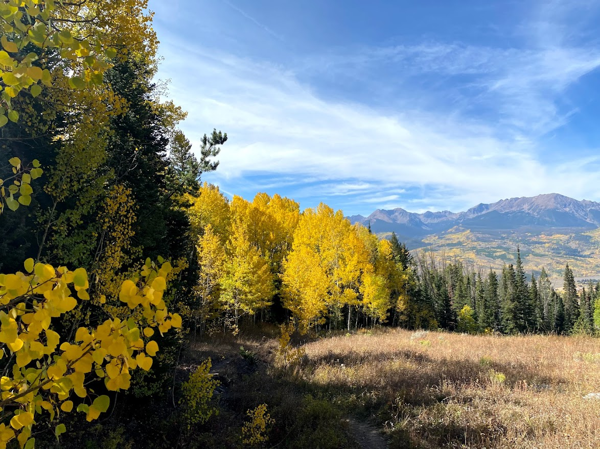

September has again been a busy month, but Sierra and I have still had the opportunity to get out a few times. Here are a few pictures of us climbing the Bastille Crack and hiking up Ute Peak.

