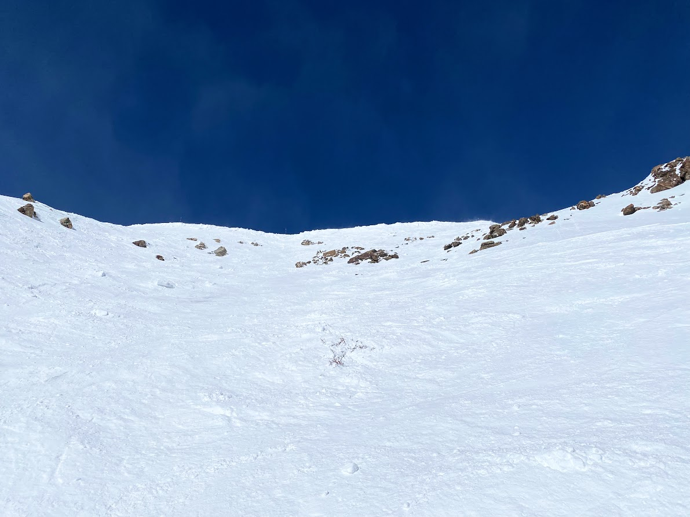

In the CU-Boulder math PhD program we call qualifying exams "Preliminary Exams" for some reason. Anyway, I passed mine. Now its time to find an advisor to begin preparing for the comprehensive exam.

## More A Basin Skiing

Have been hitting a basin quite a bit lately, trying to really focus on improving my skiing. Below is an image of a good snow day on some steeps in Montezuma Bowl.

