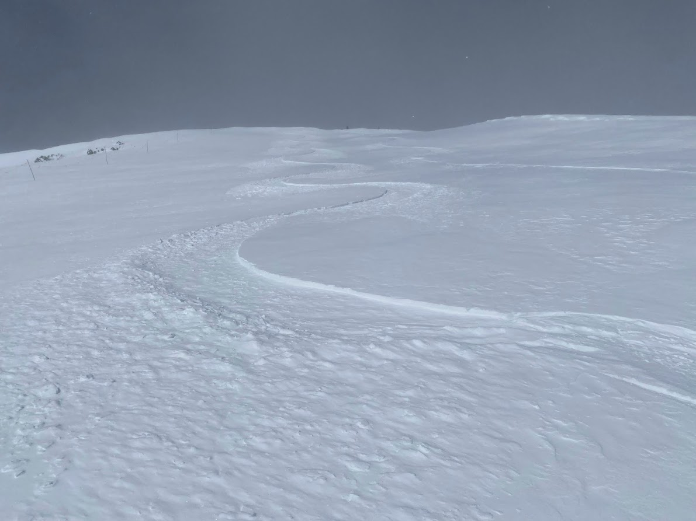
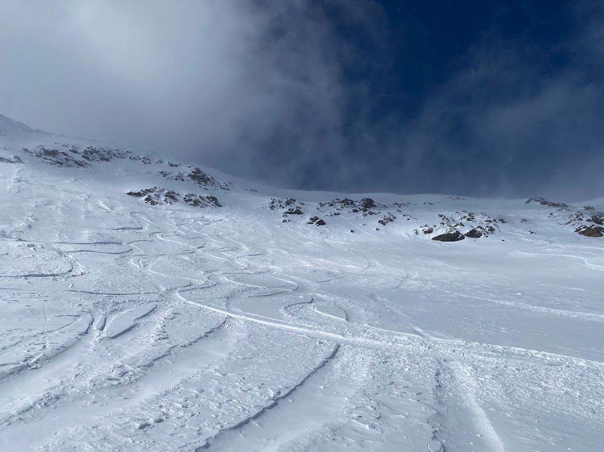
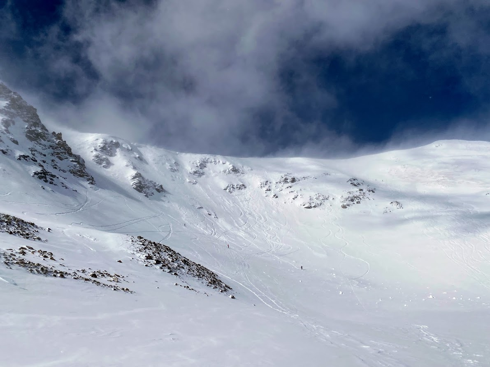
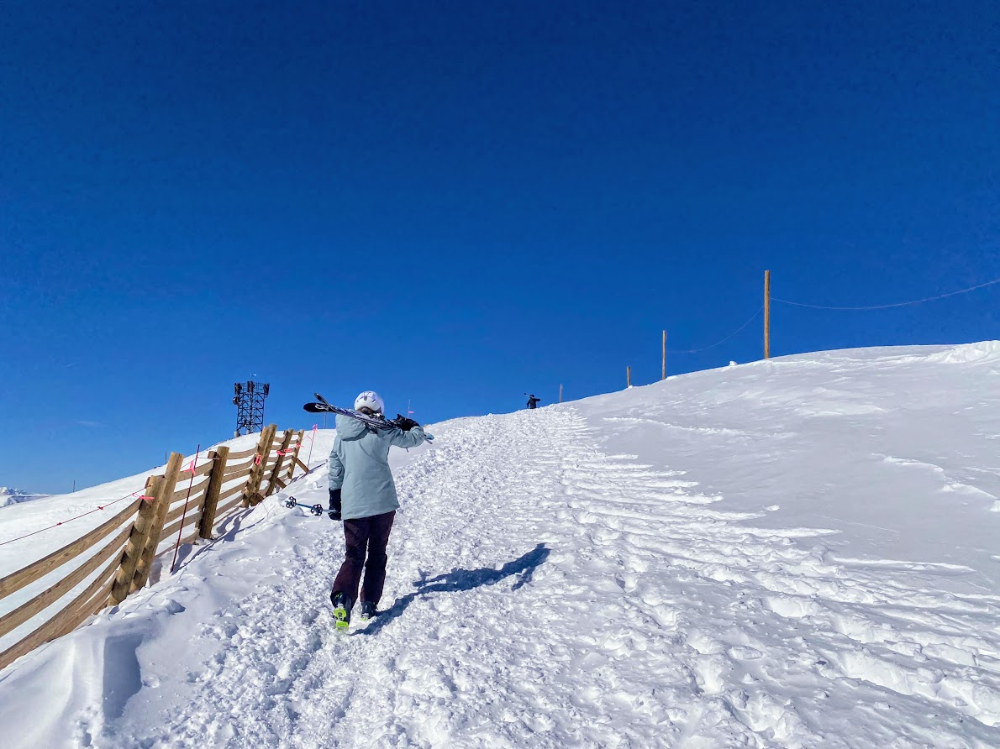
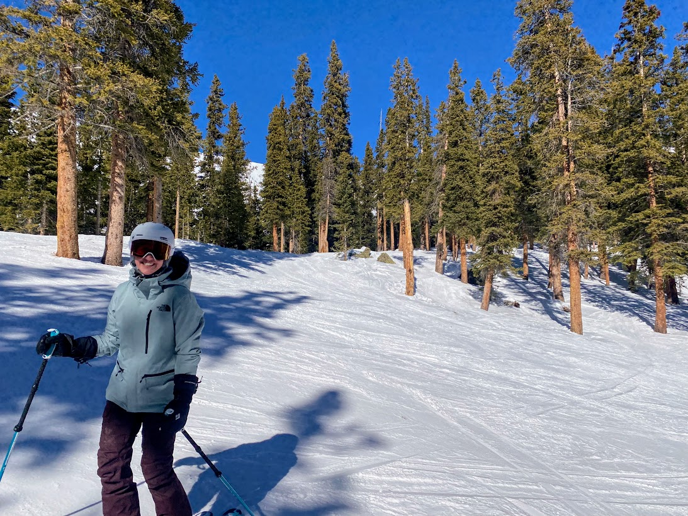
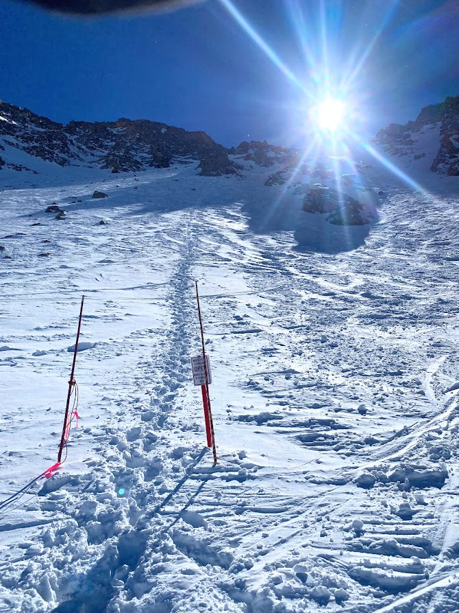
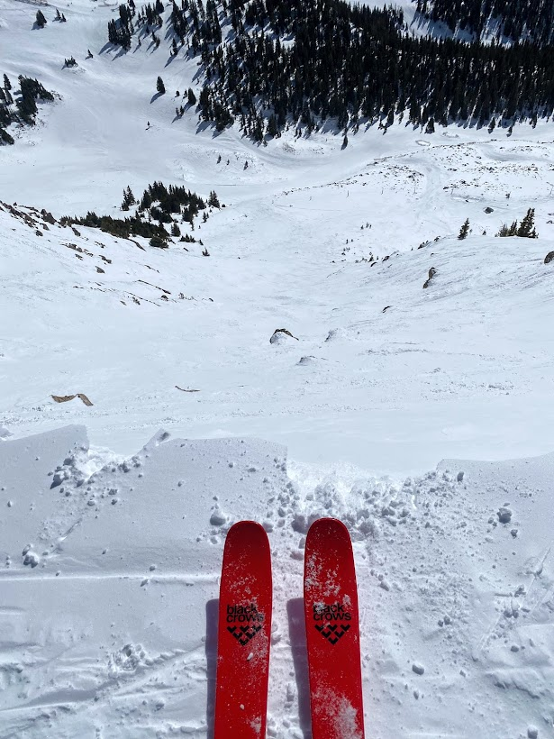
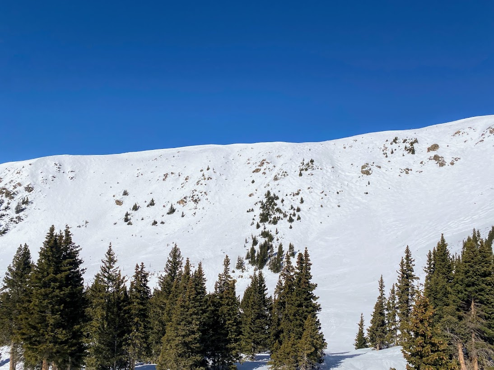

In the CU-Boulder math PhD program we call qualifying exams "Preliminary Exams" for some reason. Anyway, I passed both of mine marking a pretty big step in the graduate program.

## More A Basin Skiing

Have been hitting a basin quite a bit lately, trying to really focus on improving my skiing. Below is an image of a good snow day on some steeps in Montezuma Bowl.

## Breck skiing, 18 Feb

Have some calf problems that started while skiing last Saturday (12 Feb) and it was still give me problems skiign toda unfortunately. Gonna keep monitoring it and trying to ski, but may have to take some time off from skiing. Got to ski some more in the Lake Chutes and had some great pow turns after Breck got 9" Wednesday night.

## Arapahoe Basin, 19-20 Feb

Sierra and I got some great skiing in at A Basin over President's Day Weekend

