## A Basin Days

Had some more good days skiing A Basin recently. Had a few fresh snow days as well.

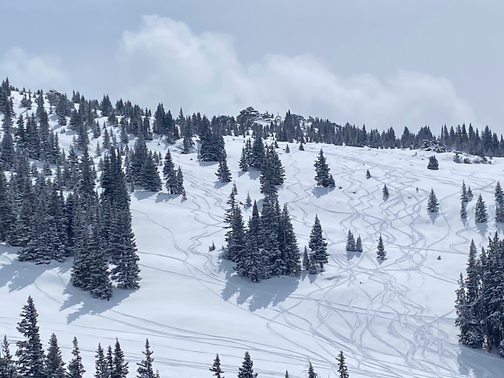

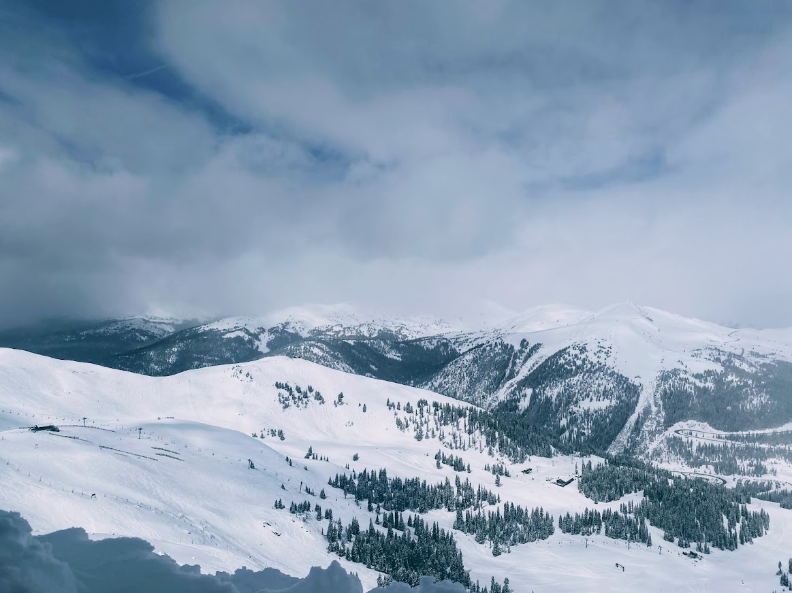

## Ski Mountaineering Course

Took a Ski Mountaineering Course to bone up my skills around some of the more technical aspects. Came away learning I needed to improve my skiing in "Upside-down" snow that has denser wind-affected snow up top with soft powder that you break down into below. But, also got to ski Dead Elk Couloir in pretty nice conditions. Can definitely improve keeping the upper body quiet while skiing...

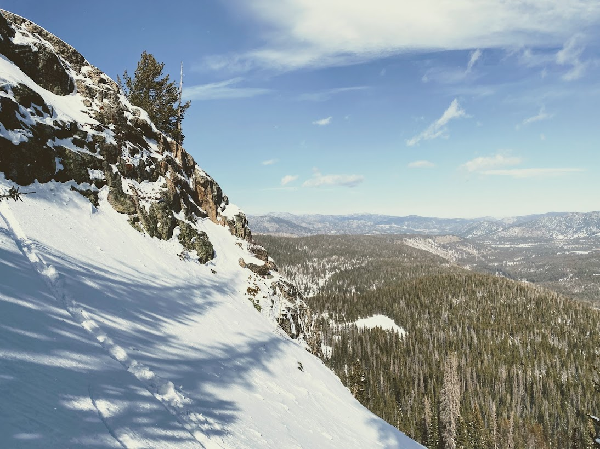

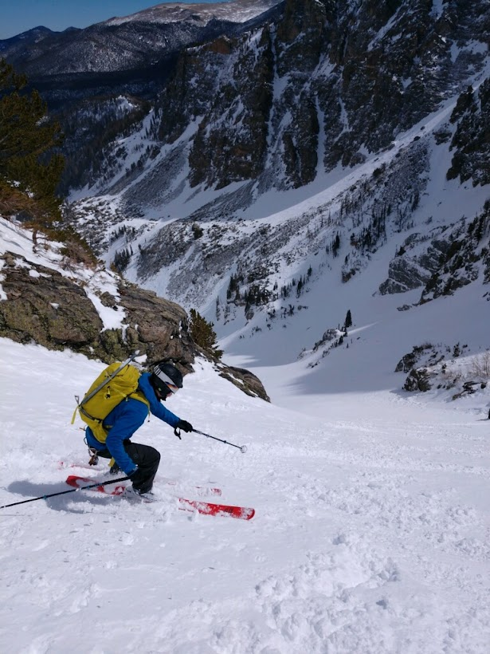

## Georgetown Trip

Sierra and I stayed in Georgetown to have a little get-away and be a bit closer to skiing. It was a great trip and it was awesome to seeing Sierra crushing some skiing again after she has been recovering from surgery.

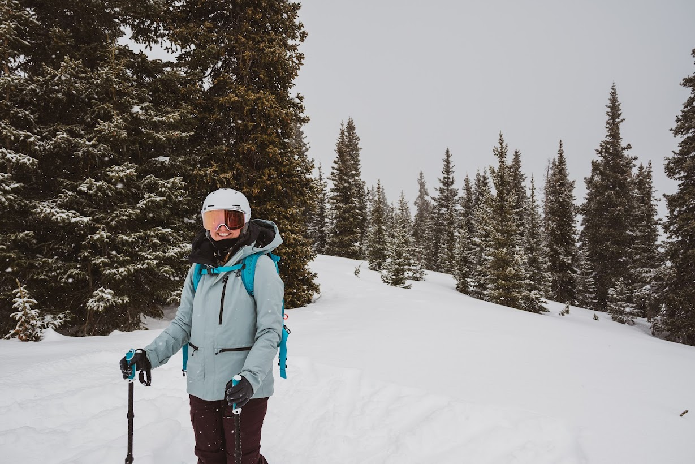

## Camping near Brainard Lake, 25-26 March

Sierra and I did a small camping trip near Brainard Lake. The road is still closed at the winter closure area, so we skied in about two miles to around the lake to set up camp and spend the night. It was a great opportunity to see what considerations we should make in the future camping in snow. It was really an amazing trip and it was awesome to spend so much time with Sierra!

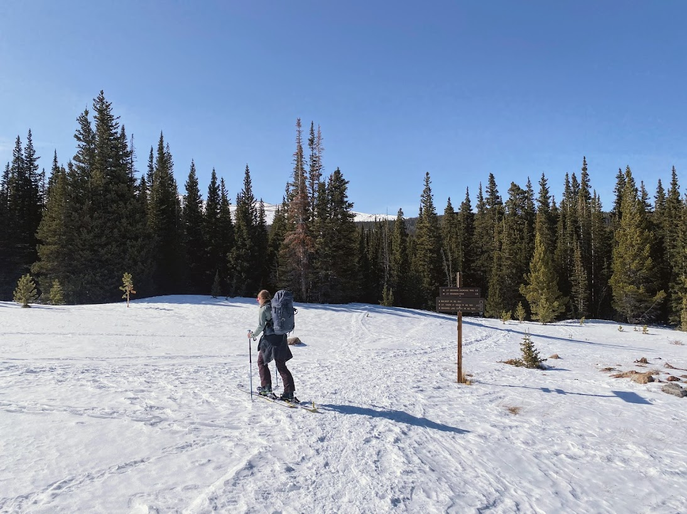

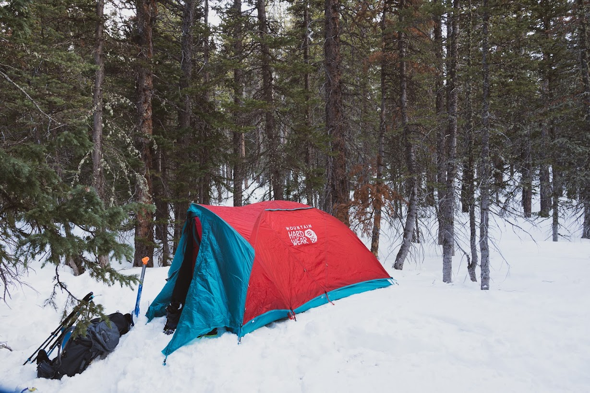

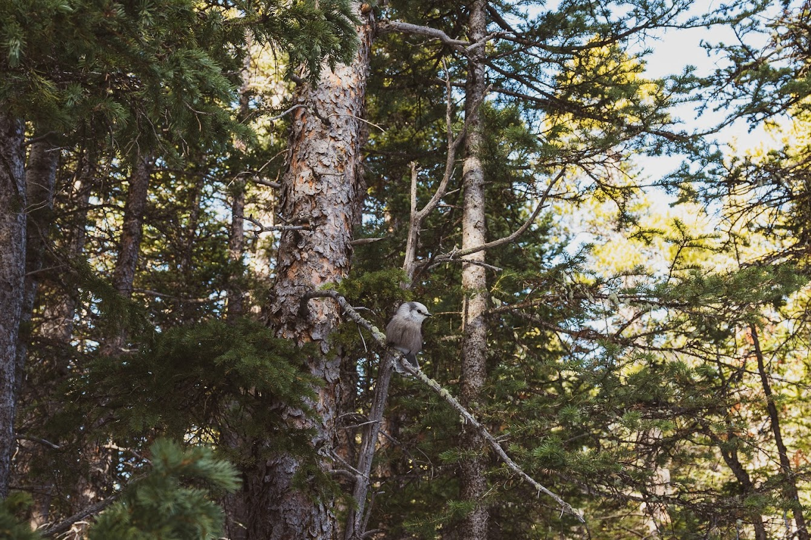

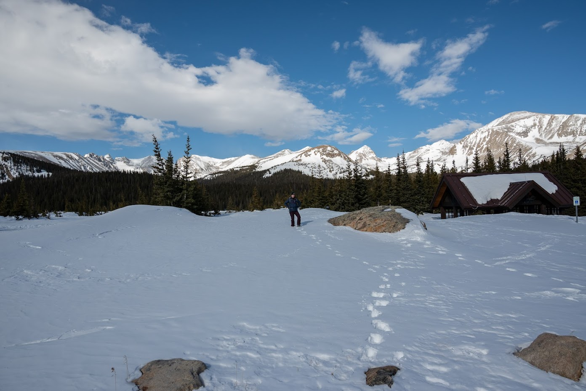

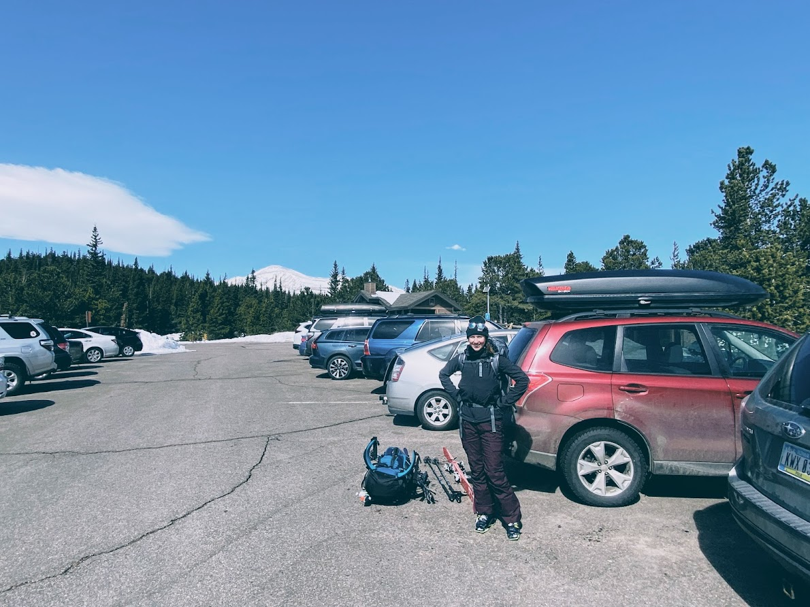

## Berthoud Pass, 31 March

Went up to Berthoud pass with the plan to just do a training day but the snow turned out to be excellent as well. End up getting 5300' of vertical in with almsot all the turns in fresh snow

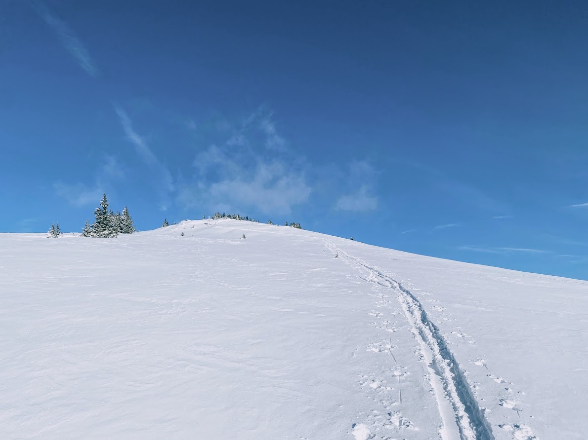

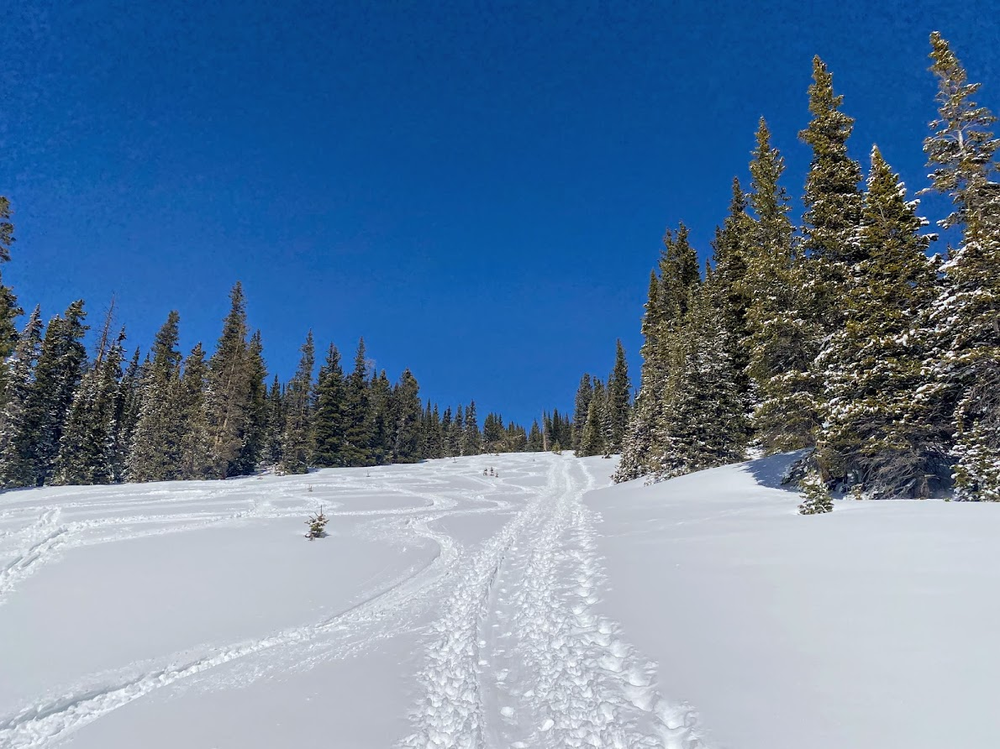

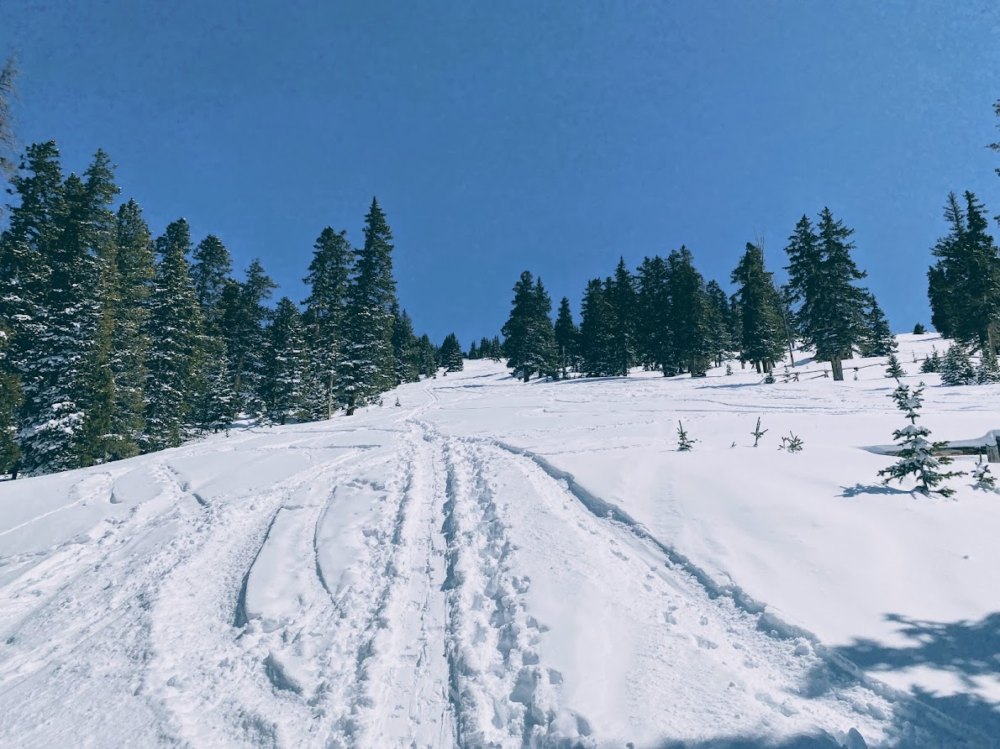

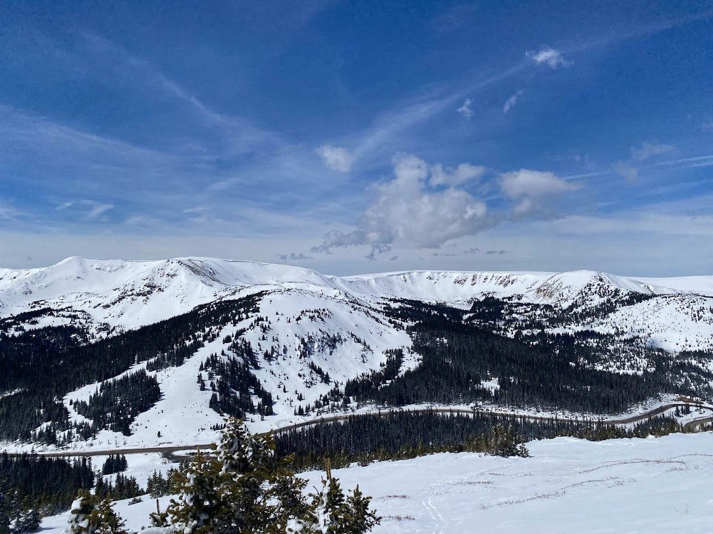
