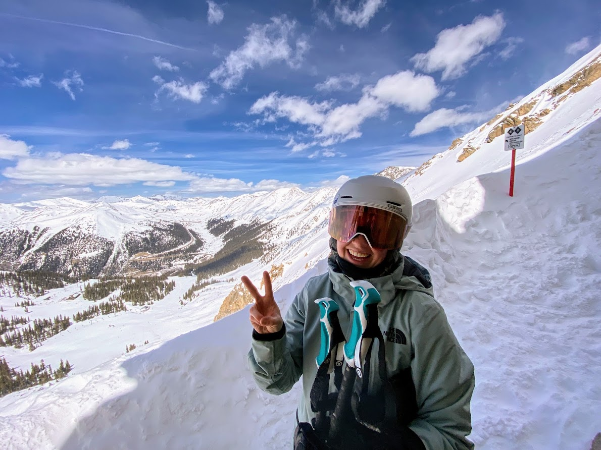
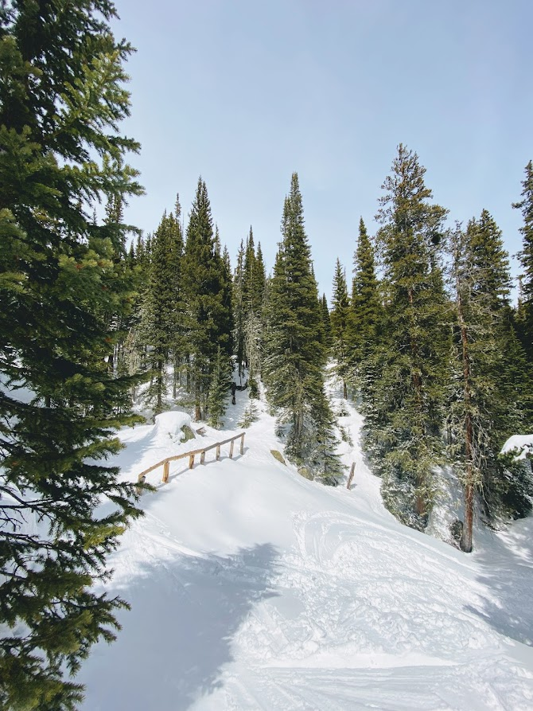
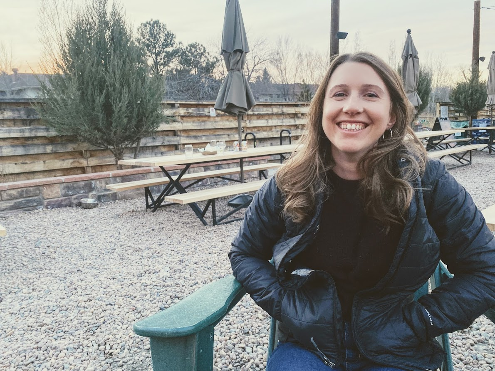
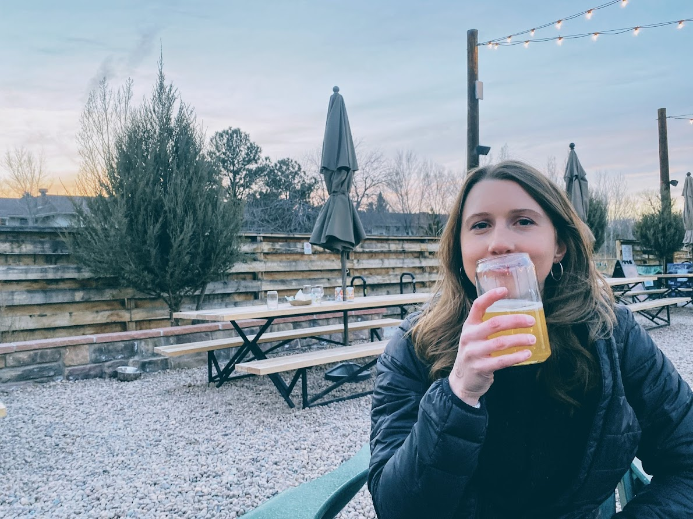

## Willie's Wide, 2 Apr

Incredibly stoked to watch Sierra boot up and slay her way down Willie's Wide on the East Wall of A Basin. Even better is we got to do it twice. Even better, the line had about 5 inches of soft wind-buff snow on top. Really fun skiing.

Willie's Wide is one of my favoirte lines at A Basin. Below is a visual of how we skied it.

<iframe height="400" frameBorder="0" style="width: 100%" src="https://fatmap.com/routeid/2935297/willie-s-wide?fmid=em"></iframe>

## Arapahoe Lakes Trees and Rayback, 3 Apr

On Sunday, Levi and I got out with a tentative plan to ski Frosty Mountain in the James Peak Wilderness. Southern aspects had been looking good in terms of having a stability, minus wind slabs and wet slabs. It was forecasted to be overcast and cold that day though, so we figured wet slabs wouldn't factor in. Wind slabs could still have presented a concern though. However, we decided not ski Frosty mainly based on wind conditions since we didn't want to be above treeline in such windy conditions. So, we got 4 laps in the trees below Arapahoe Lakes.

After skiing, Sierra and I got a few beers at Rayback in Boulder.

